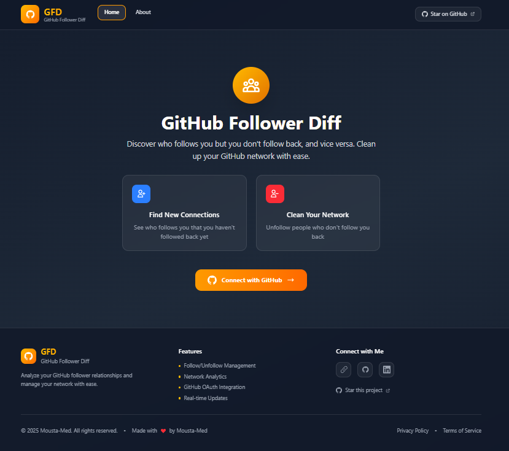

# 🚀 GitHub Follower Diff (GFD)

A beautiful, modern web application that helps developers analyze and manage their GitHub follower relationships with ease. Discover who follows you but you don't follow back, and vice versa, all through an intuitive and elegant interface.



## ✨ Features

### 🔍 **Network Analysis**

- **Real-time Analysis**: Get live insights into your GitHub follower relationships
- **Mutual Connections**: See who follows you back and who doesn't
- **Network Cleanup**: Identify users to follow or unfollow for better network management
- **Statistics Dashboard**: Beautiful cards showing follower metrics and trends

### 🎨 **Modern UI/UX**

- **Dark Theme**: Elegant dark interface with amber accents
- **Responsive Design**: Perfect experience on desktop, tablet, and mobile
- **Smooth Animations**: Polished interactions with CSS animations and transitions
- **Glassmorphism Effects**: Modern backdrop blur and transparency effects

### 🔐 **Security & Authentication**

- **GitHub OAuth 2.0**: Secure authentication with GitHub's official OAuth flow
- **CSRF Protection**: Built-in security measures against cross-site request forgery
- **Token Management**: Secure storage and automatic token refresh
- **Privacy First**: No data storage - all analysis happens in real-time

### ⚡ **Interactive Actions**

- **One-Click Follow/Unfollow**: Manage your network with single-click actions
- **Real-time Updates**: Instant feedback and data refresh after actions
- **Batch Operations**: Process multiple users efficiently
- **Action History**: Visual confirmation of completed actions

## 🛠️ Tech Stack

- **Frontend**: React 18 + TypeScript + Vite
- **Styling**: Tailwind CSS with custom animations
- **State Management**: React Hooks (useState, useEffect)
- **Routing**: React Router DOM
- **HTTP Client**: Axios
- **Icons**: Heroicons
- **UI Components**: Headless UI

## 📦 Installation

### Prerequisites

- **Node.js** (v18 or higher)
- **npm** or **yarn**
- **GitHub OAuth App** (see [Setup Guide](#-setup-guide))

### Quick Start

1. **Clone the repository**

   ```bash
   git clone https://github.com/Mousta-Med/gfd.git
   cd gfd_frontend
   ```

2. **Install dependencies**

   ```bash
   npm install
   ```

3. **Environment setup**

   ```bash
   cp .env.example .env
   # Edit .env with your GitHub OAuth credentials
   ```

4. **Start development server**

   ```bash
   npm run dev
   ```

5. **Open your browser**
   ```
   http://localhost:5173
   ```

## ⚙️ Setup Guide

### 1. GitHub OAuth App Setup

1. Go to [GitHub Developer Settings](https://github.com/settings/developers)
2. Click **"New OAuth App"**
3. Fill in the application details:
   - **Application name**: `GitHub Follower Diff`
   - **Homepage URL**: `http://localhost:5173` (for development)
   - **Authorization callback URL**: `http://localhost:5173`
4. Click **"Register application"**
5. Copy the **Client ID** (you'll need this for the `.env` file)

### 2. Environment Variables

Create a `.env` file in the root directory:

```env
# GitHub OAuth Configuration
VITE_GITHUB_CLIENT_ID=your_github_client_id_here

# Optional: For development only
VITE_GITHUB_TOKEN=your_personal_access_token_for_dev
```

### 3. Backend Server (Required)

The application requires a backend server for OAuth token exchange. Create a simple Express server:

```javascript
// server.js
const express = require("express");
const cors = require("cors");
const axios = require("axios");

const app = express();
app.use(cors());
app.use(express.json());

app.post("/api/oauth-token", async (req, res) => {
  try {
    const { code } = req.body;
    const response = await axios.post(
      "https://github.com/login/oauth/access_token",
      {
        client_id: process.env.GITHUB_CLIENT_ID,
        client_secret: process.env.GITHUB_CLIENT_SECRET,
        code: code,
      },
      {
        headers: { Accept: "application/json" },
      }
    );

    res.json(response.data);
  } catch (error) {
    res.status(500).json({ error: "Token exchange failed" });
  }
});

app.listen(3001, () => {
  console.log("Server running on port 3001");
});
```

Deploy the backend to platforms like:

- **Heroku**: `heroku create your-app-name && git push heroku main`
- **Railway**: `railway init && railway up`
- **Vercel**: Create separate repository for backend with `vercel --prod`

## 🚀 Usage Guide

### 1. **Authentication**

- Click **"Connect with GitHub"** on the homepage
- Authorize the application in the GitHub OAuth flow
- You'll be redirected back with your authenticated session

### 2. **Dashboard Overview**

After login, you'll see:

- **User Profile**: Your GitHub avatar, name, and bio
- **Statistics Cards**: Real-time follower/following counts
- **Network Analysis**: Two main sections for different relationship types

### 3. **Network Management**

#### **"You Follow But They Don't"**

- Shows users you follow who don't follow you back
- Click **"Unfollow"** to clean up your network
- Great for maintaining mutual connections

#### **"They Follow But You Don't"**

- Shows users who follow you but you haven't followed back
- Click **"Follow"** to build stronger relationships
- Perfect for discovering new connections

### 4. **Action Feedback**

- **Loading States**: See real-time progress for each action
- **Success Confirmation**: Visual feedback when actions complete
- **Auto Refresh**: Data updates automatically after actions
- **Error Handling**: Clear error messages with retry options

## 📁 Project Structure

```
src/
├── components/           # Reusable UI components
│   ├── layout/          # Layout components (Navbar, Footer)
│   └── ComparisonTable.tsx  # Main table component
├── pages/               # Page components
│   ├── Home.tsx         # Main dashboard
│   ├── About.tsx        # About page
│   ├── PrivacyPolicy.tsx # Privacy policy
│   └── TermsOfService.tsx # Terms of service
├── services/            # API and external services
│   └── githubAPI.ts     # GitHub API integration
├── App.tsx             # Main app component with routing
├── main.tsx            # App entry point
└── index.css           # Global styles and animations
```

## 🎨 Customization

### Styling

The app uses Tailwind CSS with custom configurations:

```css
/* Custom animations in index.css */
@keyframes fadeInUp {
  /* ... */
}
@keyframes slideInLeft {
  /* ... */
}
@keyframes pulse-glow {
  /* ... */
}
```

### Theme Colors

- **Primary**: Amber/Orange gradient (`from-amber-500 to-orange-500`)
- **Secondary**: Blue shades for actions
- **Accent**: Red for destructive actions
- **Background**: Dark gray gradient

### Components

All components are modular and can be easily customized:

```typescript
// Example: Customizing the ComparisonTable
<ComparisonTable
  users={users}
  label="Custom Label"
  actionType="follow"
  onActionComplete={refreshData}
/>
```

## 🔧 Development

### Available Scripts

```bash
# Development
npm run dev          # Start development server
npm run build        # Build for production
npm run preview      # Preview production build

# Code Quality
npm run lint         # Run ESLint
npm run type-check   # TypeScript type checking
```

### Development Workflow

1. **Feature Development**

   ```bash
   git checkout -b feature/new-feature
   npm run dev
   # Make your changes
   npm run lint
   npm run build
   ```

2. **Testing**

   - Test OAuth flow with your GitHub account
   - Verify responsive design on different screen sizes
   - Check error handling scenarios

3. **Building for Production**
   ```bash
   npm run build
   npm run preview  # Test production build locally
   ```

## 🚀 Deployment

### Vercel (Recommended)

1. **Connect your GitHub repository** to Vercel
2. **Configure build settings**:
   - **Framework Preset**: Vite
   - **Build Command**: `npm run build`
   - **Output Directory**: `dist`
3. **Set environment variables** in Vercel dashboard:
   ```
   VITE_GITHUB_CLIENT_ID=your_client_id
   ```
4. **Update OAuth redirect URI** in GitHub app settings:
   ```
   https://your-app.vercel.app
   ```

### Netlify

1. **Deploy from Git**: Connect your GitHub repository
2. **Build settings**:
   - **Build command**: `npm run build`
   - **Publish directory**: `dist`
3. **Environment variables**: Set `VITE_GITHUB_CLIENT_ID`
4. **Add redirects**: Create `public/_redirects` file:
   ```
   /*    /index.html   200
   ```

### Docker

1. **Create Dockerfile**:

   ```dockerfile
   FROM node:18-alpine AS builder
   WORKDIR /app
   COPY package*.json ./
   RUN npm ci
   COPY . .
   RUN npm run build

   FROM nginx:alpine
   COPY --from=builder /app/dist /usr/share/nginx/html
   EXPOSE 80
   CMD ["nginx", "-g", "daemon off;"]
   ```

2. **Build and run**:
   ```bash
   docker build -t gfd-app .
   docker run -p 3000:80 gfd-app
   ```

### Custom Server

```bash
npm run build
# Serve the dist/ directory with your preferred web server
```

## 🛡️ Security & Troubleshooting

### Security Considerations

- **OAuth Flow**: Uses secure GitHub OAuth 2.0 with CSRF protection
- **Token Storage**: Tokens stored in localStorage (consider upgrading to httpOnly cookies for production)
- **API Calls**: All GitHub API calls use authenticated user tokens
- **No Data Persistence**: No user data is stored on servers
- **HTTPS**: Always use HTTPS in production

### Common Issues & Solutions

#### OAuth Redirect URI Mismatch

- **Problem**: `redirect_uri_mismatch` error
- **Solution**: Ensure GitHub OAuth app callback URL matches your domain exactly

#### Environment Variables Not Working

- **Problem**: Variables undefined in production
- **Solution**: Ensure variables start with `VITE_` and are set in deployment platform

#### Build Failures

- **Problem**: Build process fails
- **Solution**: Check Node.js version (18+), clear cache: `rm -rf node_modules && npm install`

#### API Rate Limiting

- **Problem**: GitHub API rate limit exceeded
- **Solution**: Implement exponential backoff, cache responses when possible

#### Authentication Issues

- **Problem**: User gets logged out unexpectedly
- **Solution**: Check token expiration, clear localStorage and re-authenticate

## 🤝 Contributing

We welcome contributions! Help make this project better.

### How to Contribute

1. **Fork the repository**
2. **Clone your fork**:
   ```bash
   git clone https://github.com/your-username/gfd.git
   cd gfd_frontend
   ```
3. **Create a feature branch**:
   ```bash
   git checkout -b feature/your-feature-name
   ```
4. **Make your changes**:
   - Follow existing code style
   - Add TypeScript types
   - Test your changes thoroughly
5. **Commit with clear messages**:
   ```bash
   git commit -m "feat: add new feature"
   ```
6. **Push and submit a pull request**

### Code Style Guidelines

- Use TypeScript for all new code
- Follow existing Tailwind CSS patterns
- Use functional components with hooks
- Add proper error handling
- Include JSDoc comments for complex functions

### Development Commands

```bash
npm run dev          # Start development server
npm run build        # Build for production
npm run lint         # Run ESLint
npm run type-check   # TypeScript type checking
```

## 📄 License

This project is licensed under the MIT License - see the [LICENSE](./LICENSE) file for details.

## 🙏 Acknowledgments

- **GitHub API** for providing comprehensive user data
- **Tailwind CSS** for the beautiful styling system
- **React Community** for the amazing ecosystem
- **Heroicons** for the beautiful icon set

## 📞 Support & API Reference

### Getting Help

- **Issues**: [Report bugs](https://github.com/Mousta-Med/gfd/issues)
- **Discussions**: [Ask questions](https://github.com/Mousta-Med/gfd/discussions)
- **Email**: moustamuhammed@gmail.com

### API Reference

#### GitHub API Integration

The app integrates with GitHub's REST API using OAuth 2.0:

```typescript
// Main API functions
getAuthenticatedUser(); // Get current user info
getMyFollowers(); // Get user's followers
getMyFollowing(); // Get users you follow
followUser(username); // Follow a user
unfollowUser(username); // Unfollow a user
```

#### Rate Limits

- **5,000 requests/hour** for authenticated users
- Implement exponential backoff for rate limit errors
- Monitor `X-RateLimit-Remaining` header

#### Error Handling

```typescript
try {
  await followUser("username");
} catch (error) {
  if (error.message.includes("Rate limit")) {
    // Handle rate limit
  } else if (error.message.includes("Authentication")) {
    // Redirect to login
  }
}
```

## 🎯 Roadmap & Changelog

### Upcoming Features

- [ ] **Enhanced Analytics**: More detailed network insights and charts
- [ ] **Export Features**: Export follower data to CSV/JSON formats
- [ ] **Bulk Actions**: Select and process multiple users at once
- [ ] **Notification System**: Real-time notifications for follower changes
- [ ] **Progressive Web App**: Offline support and app-like experience
- [ ] **Dark/Light Theme Toggle**: User preference for theme selection

### Recent Updates

#### v2.0.0 - Current Version

- ✅ **Complete OAuth 2.0 Authentication** with GitHub
- ✅ **Real-time Follow/Unfollow Actions** with instant feedback
- ✅ **Enhanced UI/UX** with animations and responsive design
- ✅ **Legal Pages** (About, Privacy Policy, Terms of Service)
- ✅ **Persistent Authentication** across browser sessions
- ✅ **TypeScript Migration** for better type safety

#### v1.0.0 - Initial Release

- ✅ **Basic Follower Analysis** functionality
- ✅ **Modern React Architecture** with Vite and TypeScript
- ✅ **Tailwind CSS Styling** with dark theme
- ✅ **GitHub API Integration** for data fetching

---

<div align="center">
  <p>Built with ❤️ by <a href="https://github.com/Mousta-Med">Mousta-Med</a></p>
  <p>
    <a href="https://github.com/Mousta-Med/gfd/stargazers">⭐ Star this project</a> •
    <a href="https://github.com/Mousta-Med/gfd/issues">🐛 Report Bug</a> •
    <a href="https://github.com/Mousta-Med/gfd/issues">✨ Request Feature</a>
  </p>
</div>
